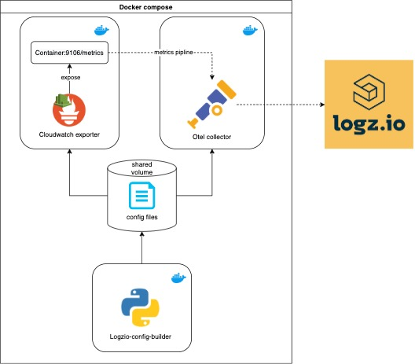

# logzio-aws-metrics
**IMPORTANT ⚠️ :** This project should be used by selected beta costumers only

We created this project To simplify shipping prometheus format metrics from cloudwatch.

### Schema

### Collect cloudwatch metrics
This docker compose uses containers with the following images:
* [otel/opentelemetry-collector](https://hub.docker.com/r/otel/opentelemetry-collector)
* [prom/cloudwatch-exporter](https://hub.docker.com/r/prom/cloudwatch-exporter)
* [logzio/config-builder]()

#### How to use:
* Download the `docker-compose.yml` file
```bash
curl https://raw.githubusercontent.com/logzio/logzio-aws-metrics/main/docker-compose.yml -o docker-compose.yml
```
* Define environment varibales and run `docker-compose up`
```bash
LOGZIO_MODULES="aws" \
AWS_ACCESS_KEY_ID=<<AWS_ACCESS_KEY_ID>> \
AWS_SECRET_ACCESS_KEY=<<AWS_SECRET_ACCESS_KEY>> \
AWS_DEFAULT_REGION=<<AWS_DEFAULT_REGION>> \
LOGZIO_REGION= <<LOGZIO_REGION>> \
LOGZIO_TOKEN=<<LOGZIO_TOKEN>> \
AWS_NAMESPACES=<<AWS_NAMESPACES>> \
SCRAPE_INTERVAL=<<SCRAPE_INTERVAL>> \
P8S_LOGZIO_NAME=<<P8S_LOGZIO_NAME>> \
docker-compose up

```
You'll also need to set up an IAM user
with the permissions to fetch the right metrics,
and the region you're fetching metrics from.

**Note:** extra charges on AWS API requests may be generated by this module.

### Configuration
#### Environment varibales for `logzio/config-builder` container
| Environment varibale | Description |
|---|---|
| AWS_DEFAULT_REGION (Required) | Your region's slug. You can find this in the AWS region menu (in the top menu, to the right). |
| LOGZIO_REGION (Required)| Your Logz.io region code. For example if your region is US, then your region code is `us`. You can find your region code here: https://docs.logz.io/user-guide/accounts/account-region.html#regions-and-urls for further information. |
| LOGZIO_MODULES (Required)| Comma-separated list of modules to be enabled on this container (formatted as "module1,module2,module3"). |
| LOGZIO_TOKEN (Required)| Token for shipping metrics to your Logz.io account. |
| SCRAPE_INTERVAL (Required)| The time interval (in seconds) where cloudwatch exporter will retrive metrics from cloudwatch, and opentelemtry collector will scrpae those metrics and send to logz.io.defualts to `300` <br> **Note:** must be a multiple of 60|
| AWS_NAMESPACES (Required) | Comma-separated list of namespaces of the metrics you want to collect. <br> You can find a complete list of namespaces at [_AWS Services That Publish CloudWatch Metrics_](https://docs.aws.amazon.com/AmazonCloudWatch/latest/monitoring/aws-services-cloudwatch-metrics.html) <br> **Note:** This Environment varibale is required unless you define the `CUSTOM_CONFIG_PATH` Environment varibale |
| P8S_LOGZIO_NAME | value for `p8s_logzio_name` external label, the purpose of this variable is to identify from which Prometheus environment the metrics are arriving to Logz.io. defualts to `logzio-cloudwatch-metrics` |
| CUSTOM_CONFIG_PATH | Path to your cloudwatch exporter configuration file, for more information refer to the [documantation](https://github.com/prometheus/cloudwatch_exporter#configuration). <br> **Note:** Set the `period_seconds` parameter according to your `SCRAPE_INTERVAL`|
| CUSTOM_LISTENER | Set a custom URL to ship metrics to (e.g., http://localhost:9200). This overrides the `LOGZIO_REGION` Environment varibale |

#### Environment varibales for `prom/cloudwatch-exporter` container
| Environment varibale | Description |
|---|---|
| AWS_ACCESS_KEY_ID (Required)| Your IAM user's access key ID. |
| AWS_SECRET_ACCESS_KEY (Required)| Your IAM user's secret key. |

#### View services configuration
You can view the configuration in the browser
* Opentelemtry collector: http://localhost:5001/config/otel
* Cloudwatch exporter: http://localhost:5001/config/cloudwatch
#### Help with region configuration

You'll need to specify the AWS region you're collecting metrics from.


Find your region's slug in the region menu
(in the top menu, on the right side).

For example:
The slug for US East (N. Virginia)
is "us-east-1",
and the slug for Canada (Central) is "ca-central-1".


